# Компьютерные сети. Лабораторная №1
**«Методы кодирования в компьютерных сетях»**


| Выполнил      | Группа | Преподаватель |
| :------------ | ------ | ------------- |
| Яковлев Г. А. | P33111 | Алиев Т. И.   |

## Цель работы
Изучение методов физического и логического кодирования, используемых в цифровых сетях передачи данных и исследование влияния свойств канала связи на качество передачи сигналов при различных методах физического и логического кодирования.

## Задание л/р
- выполнить физическое и логическое кодирование исходного сообщения в соответствии с выбранными методами кодирования и рассчитать частотные характеристики сигналов, используемых для передачи исходного сообщения, а также требуемую полосу пропускания канала связи;
- провести сравнительный анализ рассмотренных методов кодирования, выявить и сформулировать достоинства и недостатки;
- выбрать наилучший метод для передачи исходного сообщения;
- для заданного исходного сообщения и трех методов кодирования (NRZ, RZ и Manchester) выполнить исследование качества передачи физических сигналов по каналу связи в зависимости от уровня помех и шумов в канале, степени рассинхронизации передатчика и приёмника и уровня граничного напряжения (которое можно трактовать как уровень сигнала, при котором невозможно однозначно идентифицировать значения передаваемых двоичных сигналов);
- сравнить рассматриваемые методы кодирования;
- выбрать и обосновать наилучший метод для передачи исходного сообщения по реальному каналу связи с учетом затухания, шумов в канале и рассинхронизации.

## Выполнение л/р

### Этап 1. Формирование сообщения

**Исходное сообщение:** «Яковлев Г. А.»

**В шестнадцатеричном виде:** DF EA EE E2 EB E5 E2 20 C3 2E 20 C0 2E

**В двоичном коде:** 11011111 11101010 11101110 11100010 11101011 11100101 11100010 00100000 11000011 00101110 00100000 11000000 00101110

**Длина сообщения:** 13 байт (104 бит)

### Этап 2. Физическое кодирование исходного сообщения

Для определения **верхней границы** частот необходимо найти **наиболее высокочастотную** составляющую спектра в передаваемом сообщении. Высокочастотная составляющая образуется при передаче чередующихся значений 0 и 1, она будет равна удвоенной длительности битового интервала который определяется как величина, обратная значению скорости передачи данных. Отсюда верхняя граница частот будет равна: **f = C / n**

**Нижняя** **частота** зависит от **максимальной длины** последовательностей нулей или единиц, при которой не меняется уровень потенциала. Период синусоидального сигнала при передаче каждой такой последовательности равен n битовым интервалам и нижняя граница частот соответственно будет равна: **f = C / 2n**

#### Манчестерский код

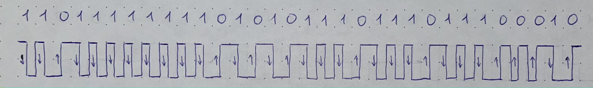

```
Верхняя граница частот: 100 МГц
Нижняя граница частот: 50 МГц
Средняя частота: (34*f0/1 + 30*f0/2) / 64 = 76.56 МГц
Спектр сигнала: 50 МГц
Полоса пропускания: 312.5 МГц
```

#### Потенциальный код без возврата к нулю NRZ

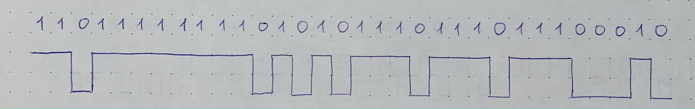

```
Верхняя граница частот: 50 МГц
Нижняя граница частот: 6.25 МГц
Средняя частота: (9*f0/1 + 2*f0/2 + 12*f0/3 + 8*f0/8) / 32 = 23.44 МГц
Спектр сигнала: 43.75 МГц
Полоса пропускания: 273.4 МГц
```

#### Биполярный импульсный код RZ

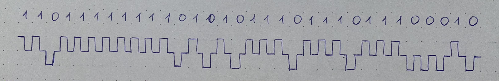

```
Верхняя граница частот: 100 МГц
Нижняя граница частот: 50 МГц
Средняя частота: (32*f0/1 + 32*f0/2) / 64 = 75 МГц
Спектр сигнала: 50 МГц
Полоса пропускания: 312.5 МГц
```

#### Биполярное кодирование с чередующейся инверсией AMI

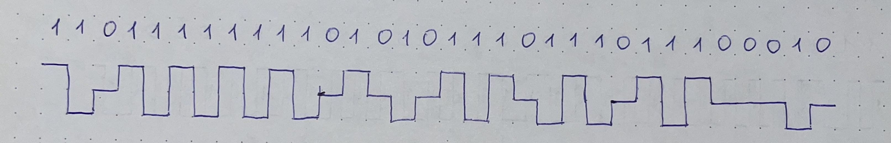

```
Верхняя граница частот: 50 МГц
Нижняя граница частот: 16.67 МГц
Средняя частота: (29*f0/1 + 3*f0/3) / 32 = 46.86 МГц
Спектр сигнала: 33.33 МГц
Полоса пропускания: 208.3 МГц
```

#### Потенциальный код с инверсией при единице NRZI

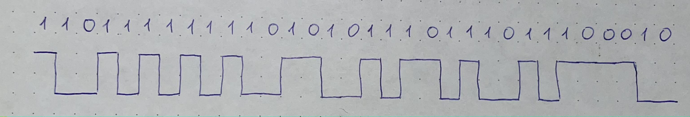

```
Верхняя граница частот: 50 МГц
Нижняя граница частот: 12.5 МГц
Средняя частота: (14*f0/1 + 14*f0/2 + 4*f0/4) / 32 = 34.38 МГц
Спектр сигнала: 37.5 МГц
Полоса пропускания: 234.3 МГц
```

#### Сравнение методов

| Метод             | Плюсы                                                        | Минусы                                                       |
| :---------------- | :----------------------------------------------------------- | :----------------------------------------------------------- |
| Манчестерский код | * Самосинхронизация: сигналом для синхронизации приёмника с передатчиком может служить изменение сигнала в середине каждого битового интервала<br />* Наличие только двух уровней потенциала<br />* Отсутствие постоянной составляющей | * Более широкий спектр сигнала по сравнению с кодами NRZ и AMI |
| NRZ               | * Простота и низкая стоимость, обусловленная наличием только двух уровней потенциала<br />* Малая ширина спектра сигнала, которая меньше, чем у других методов кодирования | * Отсутствие самосинхронизации                               |
| RZ                | * Наличие самосинхронизации<br />* Отсутствие постоянной составляющей | * Наличие трёх уровней сигнала  требует увеличения мощности передатчика для обеспечения достоверности приёма  сигналов, что увеличивает стоимость реализации<br />* Спектр сигнала шире, чем у  потенциальных кодов |
| AMI               | * Отсутствие проблемы постоянной составляющей и возможность синхронизации приёмника с передатчиком при  передаче длинных последовательностей единиц, так как в этом случае сигнал представляет собой последовательность разнополярных импульсов<br />* В общем случае спектр сигнала  при кодировании AMI меньше, чем при RZ, что обеспечивает большую пропускную  способность канала связи<br />* Возможность распознавать ошибочные (запрещённые) сигналы при нарушении чередования полярности сигналов  в процессе передачи единиц, когда после единичного сигнала появляется единичный сигнал той же полярности | * Наличие трёх уровней сигнала  требует увеличения мощности передатчика, что, естественно, увеличивает стоимость<br />* В случае длинных  последовательностей нулей в сигнале присутствует постоянная составляющая, сдвигающая спектр в низкочастотный диапазон |
| NRZI              | * Наличие двух уровней сигнала уменьшает стоимость реализации по сравнению с трехуровневым кодом AMI. |                                                              |

Эффективнее всего использовать Манчестерский код из-за наличия самосинхронизации, наличия только двух уровенй потенциала, постоянная составляющая не встречается.

### Этап 3. Логическое (избыточное) кодирование исходного сообщения

**В двоичном коде:** 1101 1111 0111 1001 0110 1110 0111 0011 1001 0100 1110 0101 1111 1000 1011 1110 0101 0010 1001 1110 1101 0101 0110 1001 1100 1010 0111 1011 0101 1110 1010 0111 00

**В шестнадцатеричном коде:** DF796E7394E5F8BE529ED569CA7B5EA70

**Длина сообщения:** 16.25 байт (130 бит)

**Избыточность:** 3.25 / 13 = 0.25 (25%)

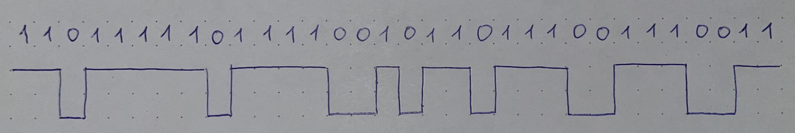

```
Верхняя граница частот: 50 МГц
Нижняя граница частот: 10 МГц
Средняя частота: (5*f0/1 + 12*f0/2 + 6*f0/3 + 4*f0/4 + 5*f0/5) / 32 = 23.44 МГц
Спектр сигнала: 40 МГц
Полоса пропускания: 40 МГц
```

Спектр сигнала уменьшился. Полоса пропускания сигнала стала уже, следовательно немного повысилась невосприимчивость сигнала к шуму и помехам.

### Этап 4. Скремблирование исходного сообщения

**Полином для скремблирования:**

$$
𝐵_𝑖 = 𝐴_𝑖 ⊕ 𝐵_{i-3} ⊕ 𝐵_{𝑖−5}
$$

**Сообщение полученное при помощи скремблирования:** 1100 0001 1101 1111 1110 1100 0000 0010 1010 1011 1100 0011 1000 1111 1010 1000 1001 0101 0010 0011 0101 0000 0100 1011 0001 0100

**В шестнадцатеричном коде:** C1DFEC02ABC38FA89523504B14

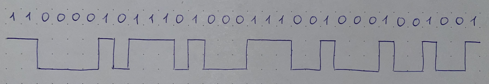

```
Верхняя граница частот: 50 МГц
Нижняя граница частот: 12.5 МГц
Средняя частота: (8*f0/1 + 8*f0/2 + 12*f0/3 + 4*f0/4) / 32 = 26.56 МГц
Спектр сигнала: 37.5 МГц
Полоса пропускания: 40 МГц
```

Спектр сигнала уменьшился. Полоса пропускания сигнала стала уже, следовательно немного повысилась невосприимчивость сигнала к шуму и помехам. Средняя частота приблизилась к фактическому среднему

### Этап 5. Сравнительный анализ результатов кодирования

| Метод                  | Плюсы                                                        | Минусы                                                       |
| ---------------------- | ------------------------------------------------------------ | ------------------------------------------------------------ |
| Манчестерский код      | * Имеет всего два уровня сигнала<br />* Отсутствует постоянная  составляющая<br />* Есть самосинхронизация | * Широкий спектр сигнала                                     |
| Избыточное кодирование | * Исчезают длинные  последовательности нулей и единиц<br />* Сужается спектр, отсутствует  постоянная составляющая<br />* Можно выявлять ошибки<br />* Простая реализация в виде  таблицы перекодировки | * Уменьшение пропускной  способности из-за лишних бит<br />* Дополнительные ресурсные затраты при логическом кодировании |
| Скремблирование        | * Нет уменьшения пропускной  способности<br />* Отсутствует постоянная составляющая | * Дополнительные ресурсные  затраты при скремблировании и дескремблировании<br />* Отсутствие гарантии исключения всех последовательностей и возможность появления новых. |

Наиболее эффективным алгоритмом кодирования для составленного сообщения является **избыточное кодирование**, так как использует меньший спектр, а также есть возможность выявления ошибок.

Ресурсные затраты для табличного кодирования несущественные, по сравнению с операцией скремблирования. Возможность выявлять ошибки нивелирует падение пропускной способности на 25%. 

### Этап 6. Определение минимальной полосы пропускания идеального канала связи

**Первые 4 байта в шестнадцатеричном виде:** DF EA EE E2

**Сообщение для отправки:** \E2EEEADF

#### Манчестерский код

**Верхняя граница частот:** 9.4 МГц

**Нижняя граница частот:** 5.0 МГц

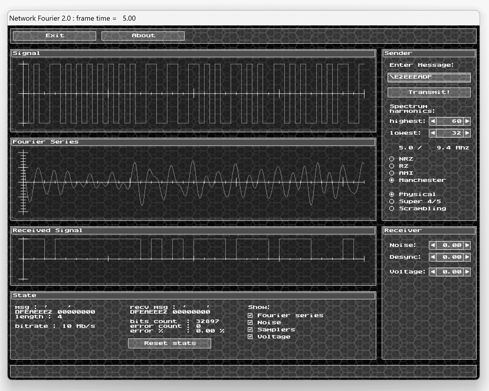

#### Потенциальный код (NRZ)

**Верхняя граница частот:** 5.0 МГц

**Нижняя граница частот:** 0.6 МГц


#### Биполярный импульсный код (RZ)

**Верхняя граница частот:** 4.7 МГц

**Нижняя граница частот:** 0.3 МГц


#### Логический NRZ (4B/5B)

**Верхняя граница частот:** 4.0 МГц

**Нижняя граница частот:** 0.8 МГц


#### Логический NRZ (Скремблирование)

**Верхняя граница частот:** 4.7 МГц

**Нижняя граница частот:** 0.6 МГц


### Этап 7. Определение максимально допустимых уровней шумов, рассинхронизации и затухания

#### Манчестерский код

```
Уровень шумов: 0.20
Уровень рассинхронизации: 0.15
Уровень затухания: 1.00
```

#### Потенциальный код (NRZ)

```
Уровень шумов: 0.15
Уровень рассинхронизации: 0.24
Уровень затухания: 0.18
```

#### Биполярный импульсный код (RZ)

```
Уровень шумов: 0.08
Уровень рассинхронизации: 0.30
Уровень затухания: 0.09
```

#### Логический NRZ (4B/5B)

```
Уровень шумов: 0.03
Уровень рассинхронизации: 0.06
Уровень затухания: 0.04
```

#### Логический NRZ (Скремблирование)

```
Уроавень шумов: 0.00
Уровень рассинхронизации: 0.01
Уровень затухания: 0.13
```

### Этап 8. Оценка достоверности распознавания сигналов на приемном конце

#### Манчестерский код

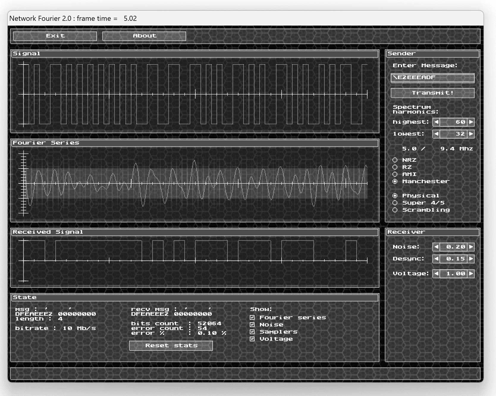

#### Потенциальный код (NRZ)


#### Биполярный импульсный код (RZ)

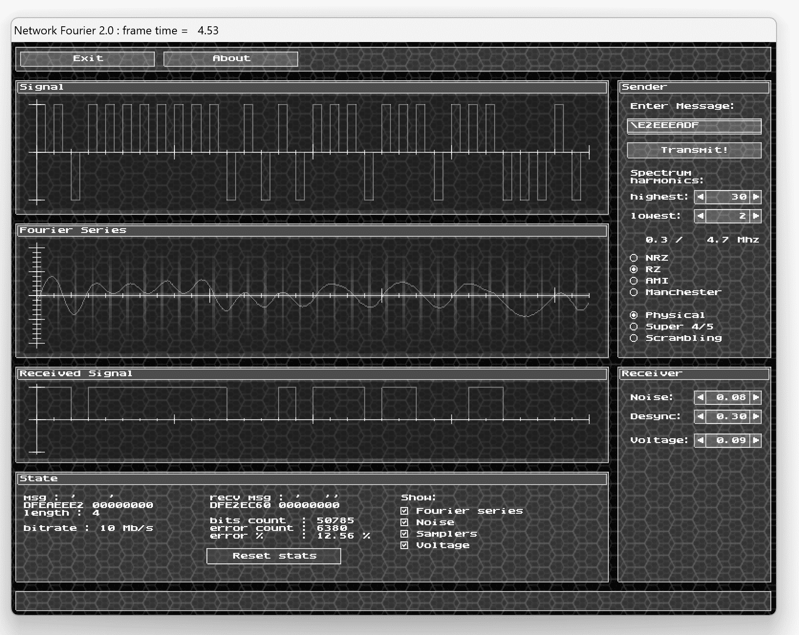

#### Логический NRZ (4B/5B)

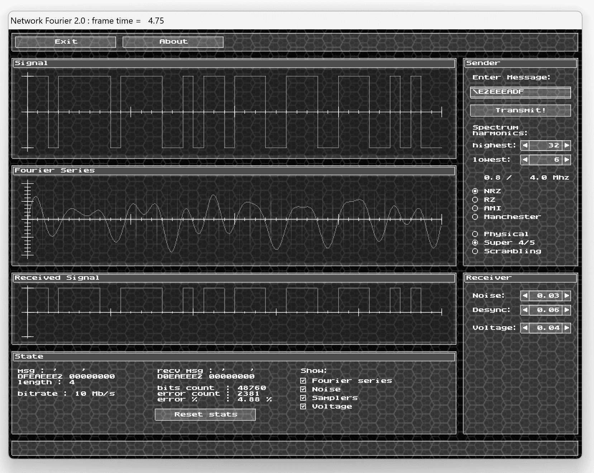

#### Логический NRZ (Скремблирование)

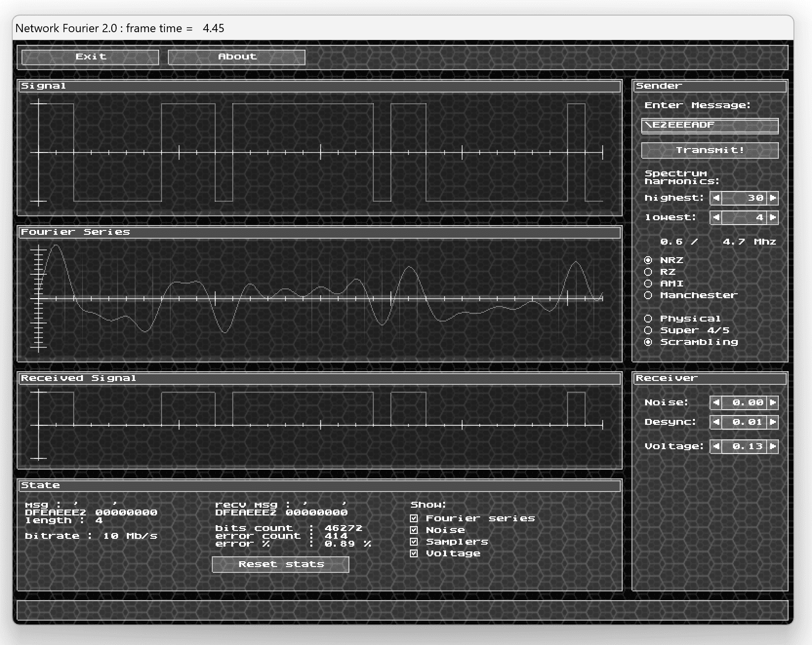

### Этап 9. Определение значений уровней шумов, рассинхронизации и граничного напряжения для реального канала связи

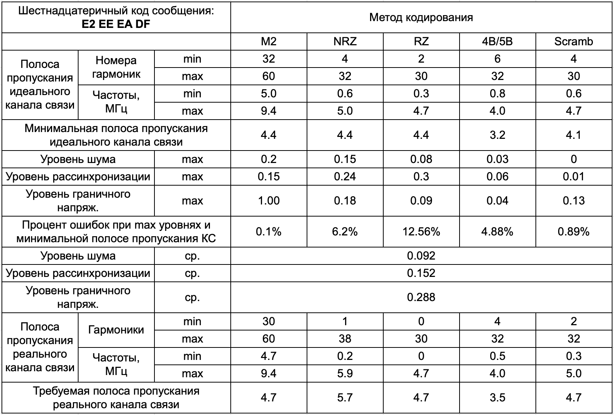

### Этап 10. Определение требуемой полосы пропускания реального канала связи

#### Манчестерский код

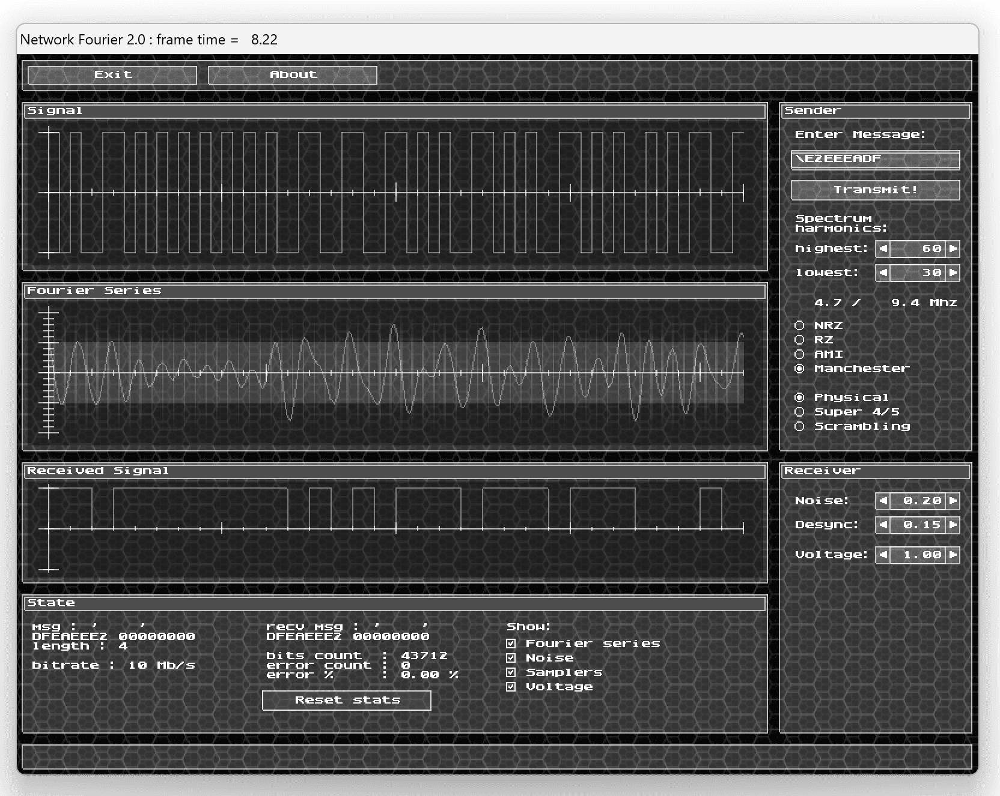

#### Потенциальный код (NRZ)


#### Биполярный импульсный код (RZ)

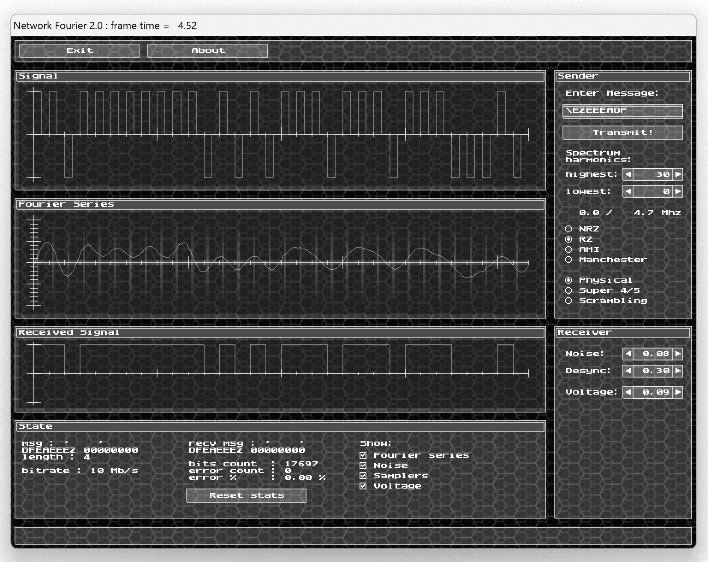

#### Логический NRZ (4B/5B)

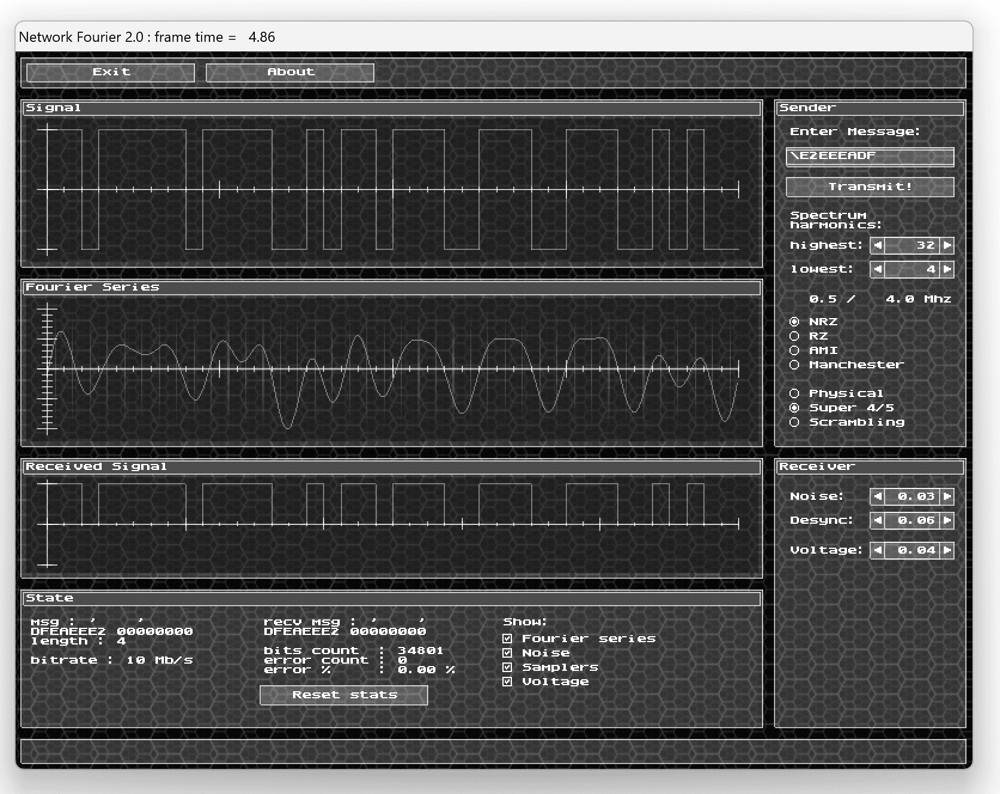

#### Логический NRZ (Скремблирование)

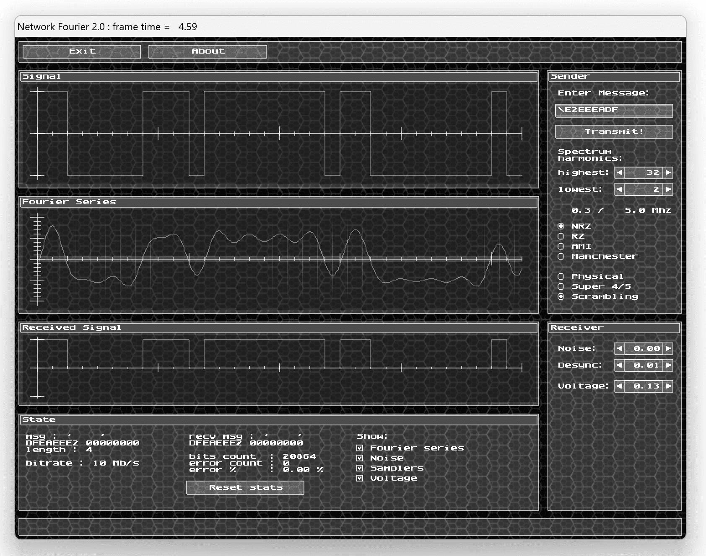

### Этап 11. Анализ полученных результатов и выбор наилучшего способа кодирования исходного сообщения

Судя по проценту ошибочных передач при совместном наличии шумов, десинхронизации и затухания – лучшими способами передачи сигнала оказались M2 и скремблирование. 4B/5B требует наименьший канал связи что говорит о его эффективности. RZ и NRZ показали наихудшие результаты по количеству ошибок и ширине спектра в идеальном канале связи. В реальном канале связи манчестерский код почти не потребовал увеличение канала для передачи сообщений без ошибок, поэтому считаю его наиболее эффективным и стабильным

## Выводы:

В ходе выполнения данной лабораторной работы я исследовал влияние свойств канала связи на качество передачи сигналов при различных методах физического и логического кодирования (манчестерский код, NRZ, RZ, избыточное кодирование и скремблирование), используемых в цифровых сетях передачи данных.
