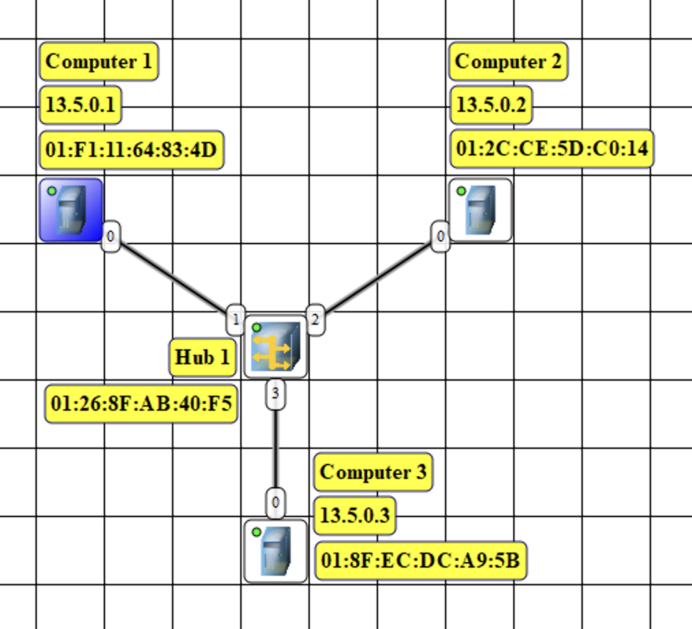
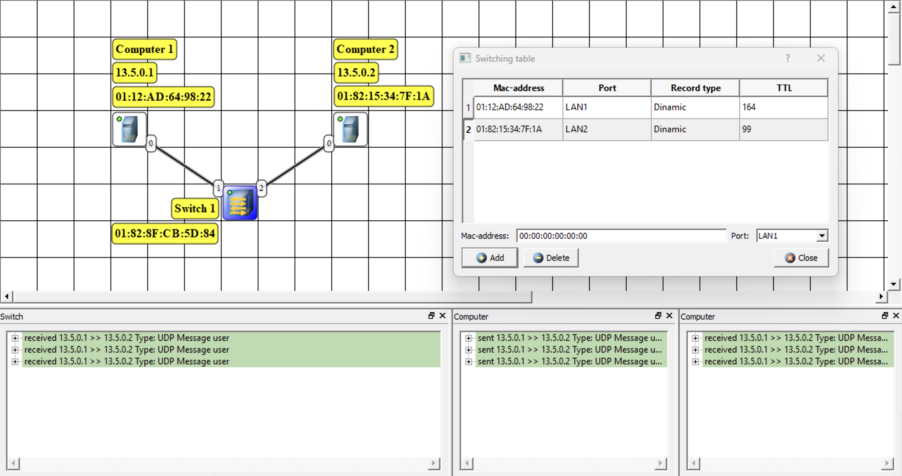
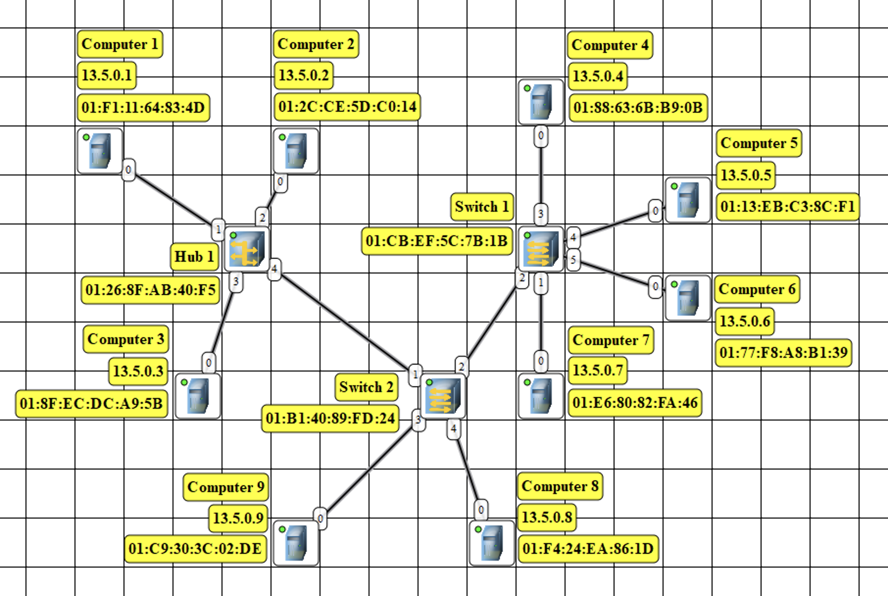

# Компьютерные сети. Лабораторная №2
**«Моделирование компьютерных сетей в среде NetEmul»**

| Выполнил      | Группа | Преподаватель |
| :------------ | ------ | ------------- |
| Яковлев Г. А. | P33111 | Алиев Т. И.   |

**Вариант 10:**
  \- Количество компьютеров в сети 1 – 3
  \- Количество компьютеров в сети 2 – 2
  \- Количество компьютеров в сети 3 – 4
  \- Класс IP-адресов – B

## Цель работы

Изучение принципов настройки и функционирования локальных сетей, построенных с использованием концентраторов и коммутаторов, а также процессов передачи данных на основе стека протоколов TCP/IP, с использованием программы моделирования компьютерных сетей NetEmul.

В процессе выполнения лабораторной работы (ЛР) необходимо:

- построить три модели локальной сети: с использованием концентратора, коммутатора и многосегментную сеть;
- выполнить настройку сети, заключающуюся в присвоении IP-адресов интерфейсам сети;
- выполнить тестирование разработанных сетей путем проведения экспериментов по передаче данных (пакетов и кадров) на основе протоколов UDP и TCP;
- проанализировать результаты тестирования и сформулировать выводы об эффективности смоделированных вариантов построения локальных сетей;
- сохранить разработанные модели локальных сетей для демонстрации процессов передачи данных при защите лабораторной работы.

## Выполнение л/р

### Сеть 1. Локальная сеть с концентратором

1. При добавления компьютеров без выдачи IP адреса их таблица маршрутизации содержала запись – **loopback шлюз** (шлюз обратной петли).
2. При назначении компьютерам IP адреса у них в таблице маршрутизации появилась запись – **шлюз локальной сети**, которой состоит компьютер.
3. После назначения IP-адреса компьютеры передавают **ARP-запросы**, чтобы определить соответствия между IPи MAC адресами других компьютеров в сети. **ARP-таблицы** хранят соответствия между MAC-адресами компьютеров в сети и их IP-адресами.

4. Тестирование сети. Отправка пакетов
   1. При отправке по протоколу UDP при том что MAC-адрес получателя указан в ARP-таблице отправляется только следующий кадр – **Ethernet** содержит MAC-адреса получателя и отправителя; **IP** содержит IP-адреса получателя и отправителя; **UDP** содержит порты получателя и отправителя
   2. При отправке по протоколу **TCP** передаются и служебные кадры в следующем порядке:
      1\. Служебный пакет на установление соединения от Компьютера 1
      2\. Служебный пакет, подтверждающий соединение от Компьютера 2
      3\. Служебный пакет, подтверждающий соединение от Компьютера 1
      4\. Пользовательские пакеты от Компьютера 1 ( по 10 Кб отправка с подтверждением), последний помечен флагом Fin
      5\. Служебный пакет, подтверждающий получение пакетов Компьютером 2

### Сеть 2. Локальная сеть с коммутатором

1. При добавления компьютеров они посылают ARP-запросы. **Коммутатор** запоминет MAC-адреса отправителей и порт с которого пришли данные.
2. Тестирование сети. Отправка пакетов
   1. При передачи данных **TTL** сбрасывается, обновляется запись в таблице маршрутизации. Посылается **ARP-запрос**, отправитель запоминает связь IP-адреса и MAC-адреса получателя и наоборот. Данные отправляются.
   2. При отправке по протоколу **TCP** передаются и служебные кадры в следующем порядке:
      1\. Служебный пакет на установление соединения от Компьютера 1
      2\. Служебный пакет, подтверждающий соединение от Компьютера 2
      3\. Служебный пакет, подтверждающий соединение от Компьютера 1
      4\. Пользовательские пакеты от Компьютера 1 ( по 10 Кб отправка с подтверждением), последний помечен флагом Fin
      5\. Служебный пакет, подтверждающий получение пакетов Компьютером 2

### Сеть 3. Многосегментная локальная сеть

1. **Таблицы маршрутизации** содержат шлюз со своим IP-адресом, **ARP-таблицы** ПК содержат соответствия между MAC-адресами других компьютеров во всей сети и их IP-адресами, **таблицы коммутации** содержат соответствия между MAC-адресами компьютеров и портом коммутатора, по которому можно достичь этих MAC-адресов.
2. Разные топологии
   1. Топологию **«Кольцо»** то же что и **«Полносвязная»** не получилось реализовать из-за возникающих коллизий. Если поменять хаб на концентратор и предварительно заполнить таблицы возможно получится избежать ошибок.
   2. Топология **«Последовательная»** показала себя хорошо только если не размещать хаб по центру. Тогда захламляется сеть, иначе довольно удобно и экономно
   3. Топология **«Звезда»** требует предзаполненных ARP-таблиц, иначе TCP transmission error. При замене хаба на коммутатор возможно избежать ошибки

## Вывод

В ходе выполнения лабораторной работы я изучил принципы настройки и функционирования локальных сетей, а также процессы передачи данных с использованием концентраторов и коммутаторов. Построил три модели локальных сетей различных конфигураций и настроил их, присвоив IP-адреса интерфейсам. Провел тестирование сетей, передавая пакеты данных с использованием протоколов UDP и TCP. Анализируя результаты тестирования, сделал выводы об эффективности различных вариантов построения локальных сетей.
