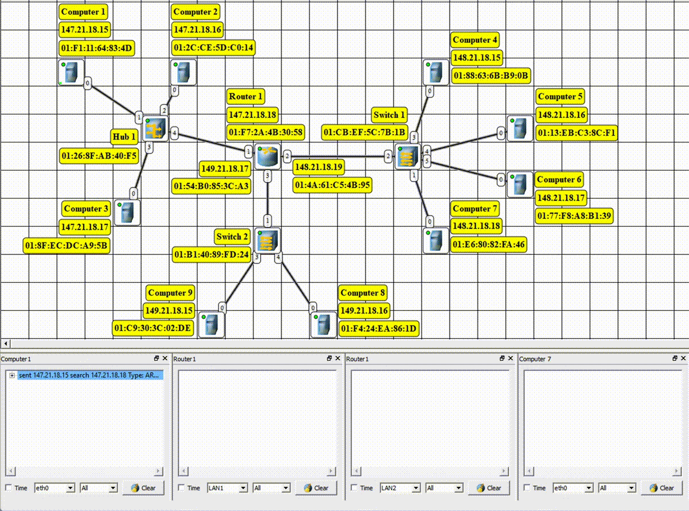
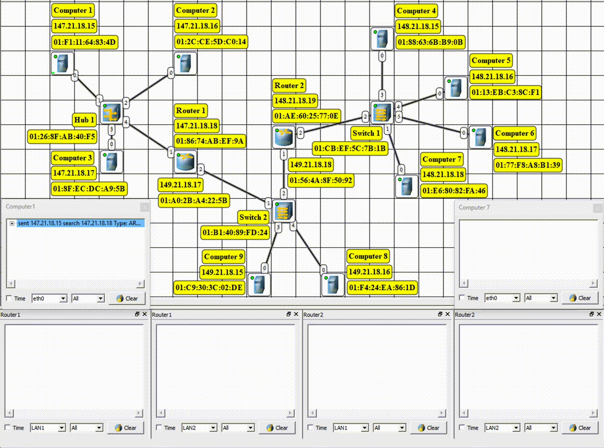
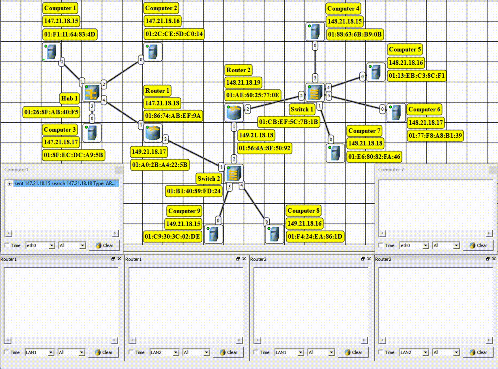
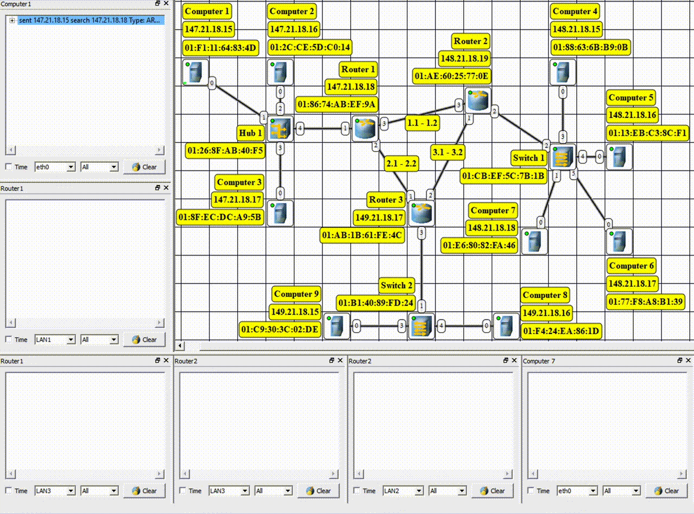
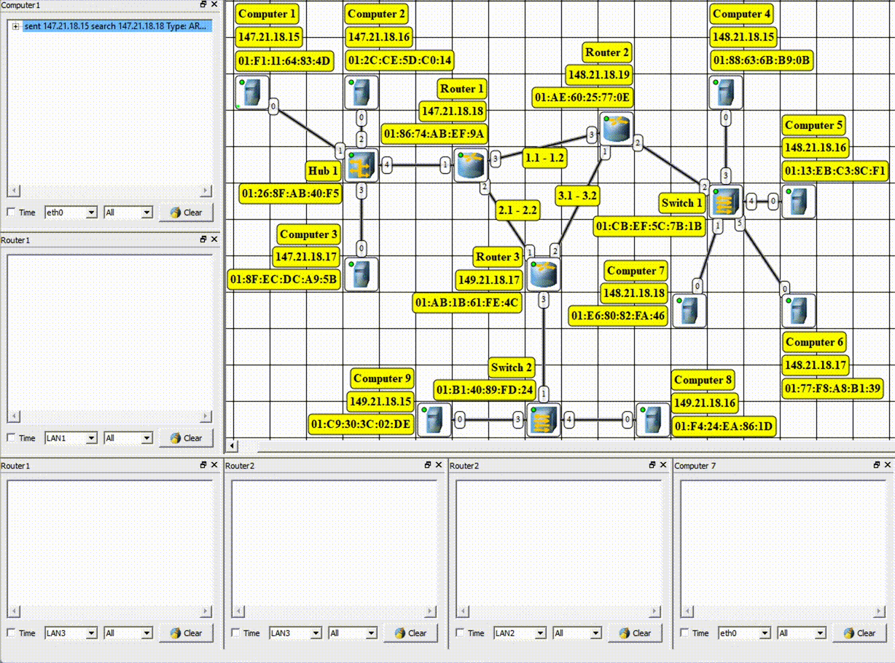

# Компьютерные сети. Лабораторная №3

**«Компьютерные сети с маршрутизаторами»**

| Выполнил      | Группа | Преподаватель |
| :------------ | ------ | ------------- |
| Яковлев Г. А. | P33111 | Алиев Т. И.   |

## Цель работы

Изучение принципов настройки и функционирования компьютерных сетей, представляющих собой несколько подсетей, связанных с помощью маршрутизаторов, процессов автоматического распределения сетевых адресов, принципов статической маршрутизации и динамической маршрутизации, а также передачи данных на основе протоколов UDP и TCP.

В процессе выполнения лабораторной работы необходимо:

- построить модели компьютерных сетей, представляющих собой несколько подсетей, объединенных в одну автономную сеть
- выполнить настройку сети при статической маршрутизации, заключающуюся в присвоении IP-адресов интерфейсам сети и ручном заполнении таблиц маршрутизации;
- промоделировать работу сети при использовании динамической маршрутизации на основе протокола RIP и при автоматическом распределении IP-адресов на основе протокола DHCP;
- выполнить тестирование построенных сетей путем проведения экспериментов по передаче данных на основе протоколов UDP и TCP;
- проанализировать результаты тестирования и сформулировать выводы об эффективности сетей с разными топологиями;
- сохранить разработанные модели локальных сетей для демонстрации процессов передачи данных при защите лабораторной работы.

## Выполнение

### Задание 1. Сеть с одним маршрутизатором

|          UDP           |          TCP           |
| :--------------------: | :--------------------: |
|  |  |

#### Содержимое таблиц маршрутизации

**Таблицы маршрутизации** – это правила для описания соответствия между адресами назначения и интерфейсами, через которые нужно отправить пакет данных. Каждая запись в таблице формируется при изменении/назначении нового IP-адреса компьютеру.

В таблице маршрутизации **компьютеров** помимо **loopback** адреса есть так же адрес **0.0.0.0** – или адрес «по умолчанию», он нужен если мы хотим отправить пакет данных компьютеру с неизвестным нашей подсети IP-адресом, мы отправим пакет по адресу по умолчанию.

В таблице маршрутизации **роутера** находятся все три интерфейса для коммуникации с каждой из подсетей.

#### Тестирование сети (отправка пакетов)

Перед отправкой пакетов **UDP**

1. через роутер в начале отправляются ARP-запросы, для идентификации mac-адреса маршрутизатора.
2. Затем происходит отправка. Сначала передается Ethernet пакет с mac-адресами отправителя и получателя, далее IP пакет с IP-адресами, после этого кадр пакет данных по UDP с информацией о портах отправителя и получателя.

При отправке пакетов по **TCP**

1. Мы сначала отправляем пакет данных с флагом **SYN**, тем самым говорим принимающему компьютеру о намерении открыть соединение, добавляя при этом **ISN** (уникальную последовательность чтобы в сети не было повторяющихся пакетов).
2. Принимающий компьютер отправляет пакет данных с флагом **ACK**, подтверждая открытие соединения. 
3. Компьютер отправляет данные.
4. В конце принимающая сторона подтверждает получение всех пакетов правильно без потерь.

### Задание 2. Сеть двумя маршрутизаторами

|          UDP           |          TCP           |
| :--------------------: | :--------------------: |
|  |  |

#### Содержимое таблиц маршрутизации

Содержимое таблиц особо не отличается от предыдущего примера. Единственное возникает сложность с центральной подсетью, т.к. не понятно какой шлюз по умолчанию для компьютеров выставить. Выставив шлюз по умолчанию на подсеть 1 этот роутер будет пересылать пакеты на другой роутер, тем самым нагружая сеть. Если бы было возможно выставить несколько шлюзов по умолчанию у нас бы происходило дублирование пакетов.

#### Тестирование сети (отправка пакетов)

Передача пакетов особо не отличается от предыдущего примера. Добавив статические записи на другой маршрутизатор получается отправлять пакеты через подсеть.

### Задание 3. Сеть тремя маршрутизаторами

|          UDP           |          TCP           |
| :--------------------: | :--------------------: |
|  |  |

#### Содержимое таблиц маршрутизации

Таблицы маршрутизации выглядят подобно двум предыдущим моделям. За исключением того, что, так как маршрутизаторы соединены между собой, они составляют собой своеобразную подсеть. Пришлось выделить группу адресов для 3 дополнительных подсетей. Также необходимо задать статические маршруты, иначе у нас не будет возможности из одной подсети попасть в другую.

#### Тестирование сети (отправка пакетов)

Передача ничем принципиальным не отличается от предыдущих случаев, за исключением добавления еще одного уровня на пути к конечной подсети (за счет коммуникации двух маршрутизаторов).

#### Настройка динамической маршрутизации по протоколу RIP

В таблицах маршрутизации появились новые записи (маршруты), соответствующие удаленным подсетям (с которыми напрямую мы не связаны). Пакеты протокола RIP посылались примерно каждые 30 секунд.

#### Настройка автоматического получения сетевых настроек по протоколу DHCP

Когда компьютер с активированным DHCP-клиентом подключается к сети, он отправляет DHCP-запрос в форме широковещательного сообщения. DHCP-сервер, получив запрос, отвечает на него сетевыми настройками. Это может включать в себя IP-адрес, маску подсети, шлюз по умолчанию и другие опции. Клиент применяет полученные сетевые настройки к своему сетевому интерфейсу. Он назначает себе IP-адрес, маску подсети и другие параметры, которые были предоставлены DHCP-сервером

## Вывод

В ходе выполнения лабораторной работы я научился настраивать компьютерные сети с использованием нескольких подсетей и маршрутизаторов. Я ознакомился с принципами статической и динамической маршрутизации, а также автоматического распределения сетевых адресов с помощью протокола DHCP. В результате экспериментов и анализа работы сетей с разными топологиями, я понял, как эффективно организовать коммуникацию между подсетями и обеспечить надежную передачу данных в сети.

## PS

Короче Тауфик люто забраковал мою лабу т.к. я выдал на каждую подсеть 65000 адресов. Пришлось в спешке переделывать.. В итоге правильно выглядит лишь третья сеть – выдано минимальное количество адресов. Еще и доп попросил сделать – связать две подсети через один маршрутизатор, вроде четко. Жалко что видосики он совсем не оценил..