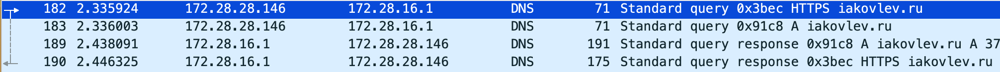

# Компьютерные сети. Лабораторная №4

**«Анализ трафика компьютерных сетей с помощью утилиты Wireshark»**


| Выполнил      | Группа | Преподаватель |
| :------------ | ------ | ------------- |
| Яковлев Г. А. | P33111 | Алиев Т. И.   |

## Цель работы

Изучить структуру протокольных блоков данных, анализируя реальный трафик на компьютере студента с помощью бесплатно распространяемой утилиты Wireshark.

В процессе выполнения лабораторной работы выполняются наблюдения за передаваемым трафиком с компьютера пользователя в Интернет и в обратном направлении. Применение специализированной утилиты Wireshark позволяет наблюдать структуру передаваемых кадров, пакетов и сегментов данных различных сетевых протоколов. При выполнении УИР требуется анализировать последовательности команд и назначение служебных данных, используемых для организации обмена данными в следующих протоколах: ARP, DNS, FTP, HTTP, DHCP.

## Выполнение

### Этап 1. Анализ трафика утилиты ping

```bash
ykvlv@macbook ~ % ping iakovlev.ru -s 1500
PING iakovlev.ru (37.143.11.11): 1500 data bytes
1508 bytes from 37.143.11.11: icmp_seq=0 ttl=58 time=14.420 ms
1508 bytes from 37.143.11.11: icmp_seq=1 ttl=58 time=14.910 ms
1508 bytes from 37.143.11.11: icmp_seq=2 ttl=58 time=13.538 ms
1508 bytes from 37.143.11.11: icmp_seq=3 ttl=58 time=13.922 ms
```


1. **Имеет ли место фрагментация исходного пакета, какое поле на это указывает?**

   Да, так как с увеличением размера пакета, мы можем видеть, что на уровне IP-протокола появляются фрагменты «Fragmented IP protocol». Флаг More Fragments как раз указывает на наличие фрагментации исходного пакета.

2. **Какая информация указывает, является ли фрагмент пакета последним или промежуточным?**

   Установленный бит MF (More Fragments) говорит о том, что данный пакет является промежуточным (не последним) фрагментом. Соответственно, если флаг MF не установлен, то пакет является последним.

3. **Чему равно количество фрагментов при передаче ping-пакетов?**

   Количество фрагментов зависит от размера пакета и соответствующего соединению MTU (Maximum Transmission Unit – максимальный размер передаваемого блока)

4. **Построить график, в котором на оси абсцисс находится размер_пакета, а по оси ординат – количество фрагментов, на которое был разделён каждый ping-пакет.**

   При отправке пакета длинее 8000 байт данные не отправляются `ping: sendto: Message too long`

   

5. **Как изменить поле TTL с помощью утилиты ping?**

   Нужно указать опцию **-m** – `ttl Set the IP Time To Live for outgoing packets. If not specified, the kernel uses the value of the net.inet.ip.ttl MIB variable`

6. **Что содержится в поле данных ping-пакета?**

   В поле данных содержится служебная информация, шестнадцетиричные значения по порядку (иногда формирующие спецсимволы, цифры и буквы английского алфавита)

   

### Этап 2. Анализ трафика утилиты traceroute

```bash
ykvlv@macbook ~ % traceroute -n iakovlev.ru
traceroute to iakovlev.ru (37.143.11.11), 64 hops max, 52 byte packets
 1  172.28.16.1  3.669 ms  4.783 ms  10.061 ms
 2  77.234.199.66  29.592 ms  4.727 ms  4.159 ms
 3  87.248.228.102  4.244 ms  4.374 ms  3.682 ms
 4  * * *
 5  * * *
 6  * * *
 7  198.18.91.105  13.520 ms  14.162 ms  14.286 ms
 8  * 198.18.91.105  12.779 ms *
 9  37.143.11.11  14.748 ms  13.718 ms  15.106 ms
```

1. **Сколько байт содержится в заголовке IP? Сколько байт содержится в поле данных?**

   В заголовке 20 байт, В поле данных 24 байта

   

2. **Как и почему изменяется поле TTL в следующих друг за другом ICMP-пакетах tracert? Для ответа на этот вопрос нужно проследить изменение TTL при передаче по маршруту, состоящему из более чем двух хопов.**

   Утилита tracert отправляет первый пакет с TTL равным 1 и увеличивает значение TTL на 1 для каждого последующего отправляемого пока назначение не ответит или пока не будет достигнуто максимальное значение поля TTL. Поскольку каждый маршрутизатор на пути обязан уменьшить значение поля TTL пакета, по крайней мере на 1 перед дальнейшей пересылкой пакета, значение TTL по сути является эффективным счетчиком переходов

3. **Чем отличаются ICMP-пакеты, генерируемые утилитой tracert, от ICMP-пакетов, генерируемых утилитой ping (см. предыдущее задание).**

   В отличие от пакетов, генерируемых утилитой ping, пакеты, генерируемые traceroute, в поле данных содержат нули

   

4. **Чем отличаются полученные пакеты «ICMP reply» от «ICMP error» и зачем нужны оба этих типа ответов?**

   Пакеты **ICMP reply** указывают на получение ответного сообщения. Пакеты **ICMP error** указывают на то, что произошла ошибка. Значение поля TYPE = 11 соответствует сообщению Time Exceeded (истекло время) 

   

5. **Что изменится в работе tracert, если убрать ключ «-d»? Какой дополнительный трафик при этом будет генерироваться?**

   В случаес с traceroute если убрать ключ -n то в выводе будут отсутствовать имена хостов, через которые проходит IP-пакет. Ключ -n предотвращает попытки команды tracert разрешения IP-адресов промежуточных маршрутизаторов в имена

   ```bash
   ykvlv@macbook ~ % traceroute iakovlev.ru
   traceroute to iakovlev.ru (37.143.11.11), 64 hops max, 52 byte packets
    1  172.28.16.1 (172.28.16.1)  3.021 ms  4.180 ms  3.536 ms
    2  77.234.199.66 (77.234.199.66)  4.203 ms  4.390 ms  3.810 ms
    3  87.248.228.102.pool.sknt.ru (87.248.228.102)  4.319 ms  4.871 ms  5.229 ms
    4  * * *
    5  * * *
    6  * * *
    7  * 198.18.91.105 (198.18.91.105)  13.554 ms  15.705 ms
    8  * * 198.18.91.105 (198.18.91.105)  12.538 ms
    9  * vip-h6.ihc.ru (37.143.11.11)  14.085 ms *
   ```

   ### Этап 3. Анализ HTTP-трафика

   


Обновив страницу в браузере, не получилось сделать так, чтобы вместо **HTTP GET** был сгенерирован **HTTP CONDITIONAL GET**. Поля If-Modified-Since, If-Match, If-Range не были приложены.

Другой браузер тоже не закешировал страницу. Результат ожидался такой:
```bash
# запрос клиента
GET /some_page HTTP/1.1
If-Modified-Since: Fri, 20 Jun 2023 11:10:08 GMT
# ответ сервера
304 Not Modified
```

### Этап 4. Анализ DNS-трафика

```bash
ykvlv@macbook ~ % sudo dscacheutil -flushcache; sudo killall -HUP mDNSResponder # macbook
```



1. **Почему адрес, на который отправлен DNS-запрос, не совпадает с адресом посещаемого сайта?**

   Так как только что был очищен кэш, необходимого получить с DNS-сервера адрес запрашиваемого сайта. Там будет найдено совпадение доменного имени и сетевого адреса

2. **Какие бывают типы DNS-запросов?**

   1. Прямой: преобразование домена в IP-адрес
   2. Обратный: преобразование IP-адреса в домен
   3. Рекурсивный: выполняется DNS-сервером, пока не будет найден домен или не будет получен ответ, что домен не существует. Рекурсия выполняется сервером
   4. Итеративный: то же самое, что рекурсивный, но также допускается выполнение поиска клиентом

3. **В какой ситуации нужно выполнять независимые DNS-запросы для получения содержащихся на сайте изображений?**

   Если запрашиваемое изображение находится на другом сервере

### Этап 5. Анализ ARP-трафика

```bash
ykvlv@macbook ~ % sudo arp -a -d
```


1. **Какие МАС-адреса присутствуют в захваченных пакетах ARP-протокола? Что означают эти адреса? Какие устройства они идентифицируют?**

   MAC-адрес отправителя – 1a:54:a0:91:d9:73 (172.28.28.145)

   MAC-адрес получателя – b0:be:83:7a:f9:c8 (172.28.28.146)

   broadcast-адрес – 00:00:00:00:00:00

   

2. **Какие МАС-адреса присутствуют в захваченных HTTP-пакетах и что означают эти адреса? Что означают эти адреса? Какие устройства они идентифицируют?**

   В HTTP-пакетах присутствуют те же самые МАС-адреса, что и в ARP запросе. Они используются для идентификации отправителя и получателя HTTP-пакета

3. **Для чего ARP-запрос содержит IP-адрес источника?**

   Чтобы узел-получатель мог добавить информацию об узле-отправителе в свою ARP- таблицу

## Вывод

Я научился анализировать трафик компьютерных сетей с использованием утилиты Wireshark. В ходе выполнения лабораторной работы я изучил структуру протокольных блоков данных, анализировал последовательности команд и назначение служебных данных в протоколах ARP, DNS, FTP, HTTP, DHCP. Я также провел анализ трафика утилиты ping и построил график зависимости количества фрагментов от размера пакета. При изучении утилиты traceroute я определил изменение значения поля TTL при передаче ICMP-пакетов и различия между ICMP-пакетами, генерируемыми утилитами tracert и ping. Кроме того, я изучил HTTP- и DNS-трафик, анализировал заголовки и поля данных в пакетах. В результате данной работы я получил навыки анализа и интерпретации трафика в компьютерных сетях.